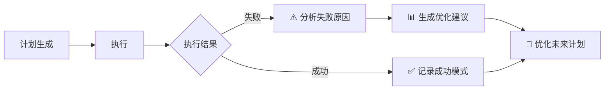
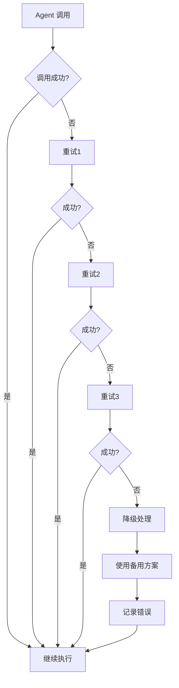

# Plan - Multi-Model Collaborative Planning

Multi-model collaborative planning - Context retrieval + Dual-model analysis 鈫?Generate step-by-step implementation plan.

$ARGUMENTS

---

## Core Protocols

- **Language Protocol**: Use **English** when interacting with tools/agents, communicate with user in their language
- **Mandatory Parallel**: Agent calls MUST use parallel Task tool calls to avoid blocking main thread
- **Code Sovereignty**: This command only generates plans, all modifications by implementation commands
- **Stop-Loss Mechanism**: Do not proceed to next phase until current phase output is validated
- **Planning Only**: This command allows reading context and writing to `.codebuddy/plan/*` plan files, but **NEVER modify production code**
- **Output Format Standardization**: All plan outputs MUST use YAML metadata + structured markdown format
- **Quality Gate Validation**: Apply plan-stage validation (format/structure) before delivery

---

## Local Agent Call Specification

**Call Syntax** (parallel: use Task tool):

```
Task({
  subagent_name: "<agent-name>",
  description: "<brief description>",
  prompt: "<task prompt with requirement and context>"
})
```

**Available Agents**:

| Phase | Backend | Frontend | General |
|-------|---------|----------|---------|
| Analysis | `backend-analyzer` | `frontend-analyzer` | `requirements-analyzer` |
| Planning | `architect` | `architect` | `planner` |

**Agent Focus**:
- `backend-analyzer`: Technical feasibility, architecture impact, performance considerations, potential risks
- `frontend-analyzer`: UI/UX impact, user experience, visual design, accessibility
- `architect`: System architecture, design patterns, scalability, technical solutions
- `planner`: Step-by-step implementation planning, task breakdown

**Wait for Agent Tasks**:

Task tool calls are synchronous by default. For multiple parallel agent calls, invoke all Task calls in the same message batch.

---

## Execution Workflow

**Planning Task**: $ARGUMENTS

### Phase 1: Full Context Retrieval

`[Mode: Research]`

#### 1.1 Prompt Enhancement (MUST execute first)

`[Mode: Prepare]`

**Step 1: Identify Input Type**

First, analyze the input to determine the requirement type:

| Input Type | Pattern | Processing Strategy |
|------------|---------|-------------------|
| **Brief** | Simple text (<500 words) | Standard enhancement via prompt-enhancer |
| **Document** | File path (.md/.docx/.pdf) OR large text (>2000 words) | Document parsing + requirement extraction |
| **Structured** | Document with chapters/sections | Document structuring + module splitting |

**Step 2: Call Appropriate Enhancement Strategy**

**If inputType === "brief" or "unstructured"**:
- Call `prompt-enhancer` agent with standard enhancement (existing logic):

```
Task({
  subagent_name: "prompt-enhancer",
  description: "Enhance user requirement",
  prompt: "Original requirement: $ARGUMENTS

Please enhance this requirement by:
1. Extracting the core intent and identifying missing details
2. Gathering project context using Glob + Grep to find:
   - Similar features and implementations
   - Existing patterns and conventions
   - Configuration files, API routes, components
3. Filling in missing technical details (frameworks, database, APIs, UI/UX, error handling, testing, performance, security)
4. Structuring the enhanced requirement according to the output template

Return the enhanced requirement in the format specified in your prompt-enhancer agent definition."
})
```

**If inputType === "document" or "structured"**:
- Call `prompt-enhancer` agent with special instructions for document parsing:

```
Task({
  subagent_name: "prompt-enhancer",
  description: "Parse and enhance large requirement document",
  prompt: "Original requirement document: $ARGUMENTS

Please identify this is a large requirement document and execute the following:

1. **Parse Document Structure** - Identify chapters, modules, and features
2. **Extract Core Requirements** - Functional, technical, and non-functional requirements
3. **Group Requirements** - By modules, priority (P0/P1/P2), and tech stack
4. **Identify Dependencies** - Dependencies between features
5. **Generate Summary** - Overall overview, module list, key requirements

OUTPUT must include these additional sections:

## Document Analysis
- Document Type: <PRD/FDD/User Story>
- Module Count: <N>
- Estimated Scope: <Small/Medium/Large>

## Functional Modules
1. <Module 1>: <Brief description>
2. <Module 2>: <Brief description>
...

## Dependency Graph
<Module dependency relationship diagram>"
})
```

**Step 3: Process Enhanced Output**

- If output contains **Functional Modules** sections, mark as "potential split needed"
- Pass this information to Phase 2.5 (Plan Scale Assessment) for reference

Wait for enhanced output, **replace original $ARGUMENTS with enhanced result** for all subsequent phases.

**Fallback**: If prompt-enhancer agent unavailable, use simple enhancement:
1. Extract key terms and entities from $ARGUMENTS
2. Use Glob + Grep to find similar implementations and patterns
3. Add basic context (project type, tech stack from package.json)
4. Structure into: Overview, Context, Requirements, Success Criteria

#### 1.2 Context Retrieval

**Use Glob + Grep for file discovery**:

1. Use `Glob` to find relevant files:
   - Configuration files: `package.json`, `*.config.js`, `.env.*`
   - Source files matching patterns: `src/**/*`, `components/**/*`, `api/**/*`
   - Test files: `tests/**/*`, `**/*.test.js`

2. Use `Grep` to find key symbols and patterns:
   - Search for relevant function names, class names
   - Find similar feature implementations
   - Locate API routes, database schemas, component definitions

3. Use `Read` to gather complete context:
   - Read full file contents for key files
   - Extract relevant code snippets
   - Understand existing patterns and conventions

**IMPORTANT**:
- Build search queries based on the enhanced requirement
- **NEVER answer based on assumptions**
- Prioritize: entry file + line number + key symbol name
- Add minimal code snippets only when necessary to resolve ambiguity

#### 1.3 Completeness Check

- Must obtain **complete definitions and signatures** for relevant classes, functions, variables
- If context insufficient, trigger **recursive retrieval**
- Prioritize output: entry file + line number + key symbol name; add minimal code snippets only when necessary to resolve ambiguity

#### 1.4 Requirement Alignment

- If requirements still have ambiguity, **MUST** output guiding questions for user
- Until requirement boundaries are clear (no omissions, no redundancy)

#### 1.5 Context Optimization & Compression (NEW)

`[Mode: Optimize]`

**Context Size Estimation**:

1. **Token Estimation Rules**:
   - English: 1 token ≈ 0.75 words
   - Chinese: 1 token ≈ 1.5 characters
   - Code: 1 token ≈ 4 characters

2. **Calculate Total Size**:
   ```
   total_tokens = enhanced_requirement_tokens + sum(file_tokens)

   enhanced_requirement_tokens:
   - Count words/characters in Phase 1.1 output

   file_tokens:
   - For each file: lines × avg_tokens_per_line
   - Code: ~10 tokens/line
   - Markdown: ~15 tokens/line
   - JSON: ~8 tokens/line
   ```

3. **Decision Thresholds**:
   - < 20K tokens: No compression needed (skip to Phase 2)
   - 20K - 30K tokens: Light compression (summarize files >300 lines)
   - 30K - 50K tokens: Medium compression + modular routing in Phase 2
   - > 50K tokens: Aggressive compression + mandatory modular routing in Phase 2

**File Relevance Scoring**:

**Scoring Factors**:
| Factor | Weight | Example |
|--------|--------|---------|
| Keyword match count | 30% | "auth" in authentication feature |
| Dependency depth | 25% | Direct imports > indirect |
| File type match | 20% | Component for frontend feature |
| Recent modification | 10% | git log recency |
| File size (penalty) | 15% | Smaller files favored |

**Scoring Algorithm**:
```
relevance_score = (
  keyword_match_count × 0.30 +
  (1 / dependency_depth) × 0.25 +
  file_type_match × 0.20 +
  recency_score × 0.10 +
  (1 / log(file_size)) × 0.15
)

dependency_depth:
  1 = directly related (e.g., component for UI feature)
  2 = one level removed (e.g., utility used by component)
  3+ = indirect (e.g., base classes, shared utilities)
```

**Ranking and Classification**:
- **Critical Priority** (Top 5-10 files): Keep full content
- **High Priority** (Files 11-20): Summarize key parts
- **Medium Priority** (Files 21-30): Brief summary only
- **Low Priority** (Files >30): Reference only (file path + purpose)

**Large File Summarization**:

**Trigger**: Files with >200 lines

**Summarization Template**:
```markdown
### File: src/auth/authentication.ts (245 lines → summarized)

**Purpose**: User authentication and session management

**Key Exports**:
```typescript
export class AuthenticationService {
  login(credentials: LoginRequest): Promise<AuthResponse>
  logout(): Promise<void>
  refreshSession(): Promise<AuthResponse>
  validateToken(token: string): boolean
}
```

**Dependencies**:
- `./session-manager.ts` - Session storage
- `./crypto.ts` - Token generation/validation
- `@external/jwt` - JWT library

**Key Patterns**:
- Uses decorator-based permission checking (@RequireAuth)
- Implements token refresh rotation
- Centralized error handling

**Relevance to Current Task**: High - Directly implements authentication flow
```

**Implementation Notes**:
- Use code-explorer subagent to extract structure
- Preserve function/class signatures
- Keep imports/exports for context understanding
- Highlight patterns relevant to current requirement

**Final Context Structure**:

Output the optimized context in hierarchical format:

```markdown
## Context Summary

### Phase 1: Enhanced Requirement
<Full enhanced requirement from Phase 1.1>

### Phase 2: Project Context

#### High Priority Context (Full Content)
| File | Lines | Purpose |
|------|-------|---------|
| src/auth.ts | 120 | Authentication core |
| components/Login.tsx | 80 | Login UI component |

**Full Content**:
<Complete file contents for high-priority files>

#### Medium Priority Context (Summarized)
| File | Original Lines | Summary |
|------|----------------|---------|
| src/utils/validation.ts | 250 | [Summarized content] |
| api/routes.ts | 180 | [Summarized content] |

#### Low Priority Context (Reference)
| File | Relevance | Note |
|------|-----------|------|
| package.json | 70% | Dependencies available on demand |
| tests/auth.test.ts | 60% | Test patterns can be loaded via code-explorer |
```

**IMPORTANT**:
- Replace the original context with this optimized structure
- Pass this to Phase 2.0 for routing decision
- Total estimated tokens must be included in summary
- If total tokens still exceed target, reduce High Priority count (keep top 5-7)

### Phase 2: Multi-Model Collaborative Analysis

`[Mode: Analysis]`

#### 2.0.1 Output Format Enforcement (NEW)

`[Mode: Standardize]`

**Mandatory YAML Metadata for All Agent Outputs**:

All agents (backend-analyzer, frontend-analyzer, architect, task-refiner) MUST return outputs with YAML metadata header:

```yaml
---
metadata:
  agent: <agent-name>
  timestamp: <ISO 8601 timestamp>
  version: "2.1"
  context_tokens: <estimated token count>
  confidence: <high/medium/low>
---
```

**Validation Rules**:
- Missing YAML header → **REJECT** and request re-output
- Invalid YAML format → **REJECT** and request re-output
- Missing required fields → **REJECT** and request re-output

**Structured Output Format**:

Each agent MUST output in the following structured format:

```markdown
## Analysis Summary

**Key Finding**: <brief 1-2 sentence summary>
**Confidence**: <high/medium/low>
**Estimated Complexity**: <simple/moderate/complex>
**Recommended Actions**: <bulleted list>

## Detailed Analysis

### Technical Considerations
<Backend/Technical analysis details>

### Impact Assessment
| Aspect | Impact | Severity |
|--------|--------|----------|
| Architecture | <description> | <low/medium/high> |
| Performance | <description> | <low/medium/high> |
| Security | <description> | <low/medium/high> |

### Recommendations
1. <Recommendation 1> with rationale
2. <Recommendation 2> with rationale

### Risks and Mitigations
| Risk | Probability | Impact | Mitigation |
|------|------------|--------|-----------|
| <Risk 1> | <low/medium/high> | <low/medium/high> | <Mitigation> |
```

**Enforcement**:
- Phase 2.1 MUST include format validation in agent prompts
- If agent output lacks required format, **MUST** request re-output with corrected format
- Store raw agent responses for feedback loop (Phase 5)

#### 2.0 Agent Routing Decision (NEW)

`[Mode: Route]`

**Check Context Size from Phase 1.5**:

```
IF total_context_tokens < 30K THEN
    → Use Standard Parallel Calls (Phase 2.1 existing logic)
ELSE IF document_analysis_available AND module_count > 1 THEN
    → Use Modular Batch Calls (Phase 2.1 Enhanced)
ELSE
    → Use Hybrid Calls (Standard + Lazy Loading, Phase 2.1 Alternative)
END IF
```

**Execution Strategy Selection Table**:

| Context Size | Document Analysis | Module Count | Strategy |
|--------------|-------------------|--------------|----------|
| < 30K tokens | N/A | N/A | Standard Parallel Calls (Phase 2.1) |
| 30K - 50K tokens | Available | > 1 | Modular Batch Calls (Phase 2.1 Enhanced) |
| 30K - 50K tokens | Not Available | N/A | Hybrid + Lazy Loading (Phase 2.1 Alternative) |
| > 50K tokens | Any | N/A | Mandatory Modular Batch Calls (Phase 2.1 Enhanced) |

**IMPORTANT**:
- Follow the routing decision strictly based on context size
- Document analysis availability determined in Phase 1.1 (check for "Functional Modules" section)
- Module count available from Phase 1.1 output

#### 2.1 Distribute Inputs

**Use the strategy selected in Phase 2.0**:

---

**Strategy A: Standard Parallel Calls** (for total_context_tokens < 30K)

**Parallel call** local agents (using `Task` tool):

Distribute **enhanced requirement** (from Phase 1.1) to both agents:

1. **Backend Analysis**:
   ```
   Task({
     subagent_name: "backend-analyzer",
     description: "Analyze backend requirements",
     prompt: "Please analyze the following requirement from a backend perspective:

   Requirement: <enhanced requirement>
   Context: <retrieved project context>

   Focus on:
   - Technical feasibility
   - Architecture impact
   - Performance considerations
   - Potential risks
   - API design (if applicable)
   - Database implications (if applicable)

   OUTPUT: Multi-perspective solutions + pros/cons analysis"
   })
   ```

2. **Frontend Analysis**:
   ```
   Task({
     subagent_name: "frontend-analyzer",
     description: "Analyze frontend requirements",
     prompt: "Please analyze the following requirement from a frontend perspective:

   Requirement: <enhanced requirement>
   Context: <retrieved project context>

   Focus on:
   - UI/UX impact
   - User experience
   - Visual design
   - Accessibility considerations
   - Responsive design
   - Component architecture

   OUTPUT: Multi-perspective solutions + pros/cons analysis"
   })
   ```

Wait for both agents' complete results.

---

**Strategy B: Modular Batch Calls** (for total_context_tokens >= 30K + document analysis available)

**FOR EACH functional_module IN document_analysis.modules**:

```
1. Extract module-specific context:
   - Module requirements
   - Related files (from prioritized list in Phase 1.5)
   - Module dependencies

2. Call agents for this module:
   PARALLEL(
     Task({
       subagent_name: "backend-analyzer",
       description: "Analyze <module_name> backend requirements",
       prompt: "Please analyze the following module from a backend perspective:

   Module: <module_name>
   Description: <module_description>
   Requirements: <module_requirements>
   Dependencies: <module_dependencies>
   Context: <module_specific_context>

   Focus on:
   - Technical feasibility
   - Architecture impact
   - Performance considerations
   - Potential risks
   - API design (if applicable)
   - Database implications (if applicable)

   OUTPUT: Multi-perspective solutions + pros/cons analysis for this module"
     }),
     Task({
       subagent_name: "frontend-analyzer",
       description: "Analyze <module_name> frontend requirements",
       prompt: "Please analyze the following module from a frontend perspective:

   Module: <module_name>
   Description: <module_description>
   Requirements: <module_requirements>
   Dependencies: <module_dependencies>
   Context: <module_specific_context>

   Focus on:
   - UI/UX impact
   - User experience
   - Visual design
   - Accessibility considerations
   - Responsive design
   - Component architecture

   OUTPUT: Multi-perspective solutions + pros/cons analysis for this module"
     })
   )

3. Store module analysis result
END FOR
```

**Module-Specific Context Extraction Logic**:

```
function extractModuleContext(module, prioritizedFiles) {
  const moduleContext = {
    requirements: module.requirements,
    dependencies: module.dependencies,
    files: []
  };

  // Match files to module based on:
  // - Keyword similarity (module.name vs file.path)
  // - Dependency graph (files used by module)
  // - Relevance score from Phase 1.5

  for (const file of prioritizedFiles) {
    const relevance = calculateModuleRelevance(module, file);
    if (relevance > 0.6) {
      moduleContext.files.push({
        path: file.path,
        content: file.content, // Full or summarized based on priority
        relevance: relevance
      });
    }
  }

  return moduleContext;
}

calculateModuleRelevance(module, file):
  - Exact keyword match: +0.8
  - Partial keyword match: +0.5
  - File in dependency chain: +0.6
  - File type match (component for UI, api for backend): +0.4
  - Adjust by Phase 1.5 relevance score (weighted average)
```

**Wait for all module analyses** before proceeding to Phase 2.2 Enhanced.

---

**Strategy C: Hybrid + Lazy Loading** (for total_context_tokens >= 30K + no document analysis)

**Initial Agent Call** (with high-priority context only):

```
Task({
  subagent_name: "backend-analyzer",
  description: "Analyze backend requirements",
  prompt: "Please analyze the following requirement from a backend perspective:

Requirement: <enhanced requirement>

High Priority Context:
<Full content of high-priority files from Phase 1.5>

Additional Context Available:
- Medium priority files: N files (summarized)
- Low priority files: M files (reference only)

If you need more details about specific files, use the code-explorer subagent:
Task({
  subagent_name: "code-explorer",
  description: "Get detailed file context",
  prompt: "Retrieve full content and analysis for: <file_path>
   Include: file structure, key functions/classes, dependencies, patterns"
})

Focus on:
- Technical feasibility
- Architecture impact
- Performance considerations
- Potential risks
- API design (if applicable)
- Database implications (if applicable)

OUTPUT: Multi-perspective solutions + pros/cons analysis"
})
```

**Repeat for frontend-analyzer** with same lazy loading pattern.

**Lazy Loading Benefits**:
- Reduces initial token payload by 40-60%
- Allows agent to request relevant context on-demand
- Maintains flexibility for complex scenarios

**IMPORTANT**:
- Track cumulative tokens across lazy loads
- Set hard limit: total tokens < 60K
- If limit reached, summarize lazy-loaded responses

---

#### 2.2 Cross-Validation (Enhanced)

**Standard Cross-Validation** (for Strategy A and C):

Integrate perspectives and iterate for optimization:

1. **Identify consensus** (strong signal)
2. **Identify divergence** (needs weighing)
3. **Complementary strengths**: Backend logic follows backend-analyzer, Frontend design follows frontend-analyzer
4. **Logical reasoning**: Eliminate logical gaps in solutions

**Enhanced Cross-Validation for Modular Batch Calls** (Strategy B):

1. **Cross-Module Consistency Check**:
   - Identify conflicting solutions between modules
   - Detect shared dependencies (common patterns, utilities)
   - Verify dependency graph alignment from Phase 1.1

2. **Integration Points Identification**:
   - Module A's output → Module B's input
   - Shared data models
   - Common UI components
   - API contracts between modules

3. **Architectural Coherence**:
   - Ensure consistent tech stack across modules
   - Validate data flow alignment
   - Check for overlapping responsibilities

4. **Generate Integrated Analysis**:
   - Combine module-specific perspectives
   - Add integration considerations
   - Optimize execution order using dependency graph

**Output Format for Enhanced Validation**:

```markdown
## Integrated Analysis

### Module-wise Perspectives
1. Module A: <backend-analyzer + frontend-analyzer results>
2. Module B: <backend-analyzer + frontend-analyzer results>
...

### Cross-Module Integration
- Shared dependencies: <list>
- Integration points: <list>
- Dependency flow: <diagram>

### Architectural Coherence
✓ Tech stack consistency: <confirmed/needs adjustment>
✓ Data flow alignment: <confirmed/needs adjustment>
⚠️ Conflicts to resolve: <list>
```

#### 2.3 (Optional but Recommended) Dual-Agent Plan Draft

**For Standard Parallel Calls (Strategy A/C)**:

To reduce risk of omissions in Claude's synthesized plan, can parallel have both agents output "plan drafts" (still **NOT allowed** to modify files):

1. **Backend Plan Draft**:
   ```
   Task({
     subagent_name: "architect",
     description: "Draft backend implementation plan",
     prompt: "Please draft a step-by-step backend implementation plan for:

   Requirement: <enhanced requirement>
   Context: <retrieved project context>
   Backend Analysis: <result from 2.1>

   Focus on:
   - Data flow and architecture
   - Edge cases and error handling
   - Test strategy
   - Security considerations
   - Performance optimization

   OUTPUT: Step-by-step plan with pseudo-code. DO NOT modify any files."
   })
   ```

2. **Frontend Plan Draft**:
   ```
   Task({
     subagent_name: "architect",
     description: "Draft frontend implementation plan",
     prompt: "Please draft a step-by-step frontend implementation plan for:

   Requirement: <enhanced requirement>
   Context: <retrieved project context>
   Frontend Analysis: <result from 2.1>

   Focus on:
   - Information architecture
   - User interaction flows
   - Accessibility
   - Visual consistency
   - Responsive design

   OUTPUT: Step-by-step plan with pseudo-code. DO NOT modify any files."
   })
   ```

Wait for both agents' complete results, record key differences in their suggestions.

**For Modular Batch Calls (Strategy B)**:

Skip this phase - plan drafts are already generated per module in Phase 2.1.

---

#### 2.5 Plan Scale Assessment (NEW)

**Enhanced Assessment with Document Analysis** (when available):

If Phase 1.1 identified the input as a large document and returned **Functional Modules**:

1. **Use Document Analysis Results**:
   - Check if Document Analysis indicates **"Recommended Split: Yes"**
   - Review the **Module Count** from document analysis
   - Examine the **Dependency Graph** for natural split points

2. **Document-Based Decision**:
   - Large documents (>2000 words, Module Count > 3) → **Recommend split**
   - Use functional modules as natural split boundaries
   - Dependency graph provides execution order

**Standard Scale Assessment** (when no document analysis):

**Evaluation Criteria**:

| Metric | Suggest Split | Force Split |
|--------|--------------|-------------|
| Steps | > 7 | > 10 |
| Files | > 15 | > 20 |
| Estimated Time | > 4h | > 8h |
| Functional Modules | Multiple | Multiple |
| Tech Stacks Involved | Frontend+Backend+DB | Any |

**Decision Logic**:

- **No split needed**: All metrics below "Suggest Split" thresholds
- **Suggest split**: Any metric reaches "Suggest Split" threshold
- **Force split**: Any metric reaches "Force Split" threshold

**If splitting is needed**, skip to **Phase 2.6: Plan Splitting**

**If no splitting needed**, proceed to **Phase 2.7: Generate Single Plan**

---

#### 2.6 Plan Splitting (NEW - when triggered)

`[Mode: Split]`

When plan scale assessment indicates splitting is needed:

##### 2.6.1 Choose Splitting Strategy

Analyze the plan characteristics and choose the most appropriate strategy:

**If Document Analysis Available (from Phase 1.1)**:

Prioritize using document's **Functional Modules** and **Dependency Graph**:

| Strategy | When to Use | Key Indicator |
|----------|-------------|---------------|
| **By Functional Module** | Document provides module list | Use Functional Modules directly |
| **By Document Structure** | Document has clear chapters | Align with document chapters |
| **By Dependency Graph** | Document provides dependencies | Use Dependency Graph for order |
| **By Priority** | Document indicates priorities | Use P0/P1/P2 from document |

**Standard Strategy Selection (no document analysis)**:

| Strategy | When to Use | Key Indicator |
|----------|-------------|---------------|
| **By Functional Module** | Multiple independent features | "Implement A, B, C, D" |
| **By Tech Stack** | Large frontend & backend work | "UI + API" |
| **By Dependencies** | Features have clear order | "A depends on B" |
| **By Priority** | Features have different priorities | "Core (P0), Enhancement (P1)" |

##### 2.6.2 Generate Master Plan

Create a master plan file: `.codebuddy/plan/<feature-name>-master.md`

```markdown
## 总计划：<Feature Name>

### 子计划列表

1. **计划1: <Module 1 Name>** (`<module-1-slug>`)
   - 优先级: <P0/P1/P2/P3>
   - 依赖: <none or list>
   - 预计耗时: <X hours>

2. **计划2: <Module 2 Name>** (`<module-2-slug>`)
   - 优先级: <P0/P1/P2/P3>
   - 依赖: <none or list>
   - 预计耗时: <X hours>

...

### 执行顺序
<Dependency graph or execution sequence>

### 总耗时
<Estimated total time (considering parallel execution)>
```

##### 2.6.3 Generate Sub-Plans

For each sub-plan, generate a detailed plan file with mandatory YAML metadata:

`.codebuddy/plan/<module-slug>.md`

Each sub-plan must include:

```yaml
---
plan:
  name: "<Module Name>"
  type: "subplan"
  parent: "<master-plan-name>"
  version: "2.1"
  created_at: "<ISO 8601 timestamp>"

metadata:
  complexity: <simple/moderate/complex>
  estimated_time: "<X hours Y minutes>"
  priority: <P0/P1/P2/P3>
  tech_stack:
    - <tech-1>
    - <tech-2>

dependencies:
  requires:
    - <dependency-plan-1> | null
  required_by:
    - <dependent-plan-1> | null

quality:
  validation_status: "passed"
  format_version: "2.1"
---
```

```markdown
## 子计划：<Module Name>

### 概述
<Brief description of this module>

### 任务类型
- [x] Backend / Frontend / Fullstack

### 实施步骤
1. <Step 1> - Expected deliverable
2. <Step 2> - Expected deliverable
...

### 关键文件
| File | Operation | Description |
|------|-----------|-------------|
| path/to/file.ts | Create/Modify | Description |

### 风险和缓解
| Risk | Mitigation |
|------|------------|

### 依赖
<List of dependencies (or "无")>

### 后续依赖
<List of plans that depend on this one>
```

**Sub-Plan Validation**:
- Each sub-plan MUST pass same quality gate as master plan
- Check dependencies are declared correctly
- Validate estimated times are reasonable (2-4 hours per sub-plan)

##### 2.6.4 OpenSpec Link Validation (NEW - for --openspec mode)

`[Mode: Validate]`

If the `--openspec` flag was provided:

1. **Detect if linking to existing OpenSpec changes**:
   - Check if any sub-plans link to existing OpenSpec changes
   - Look for `关联 OpenSpec 变更` references in sub-plans

2. **Validate OpenSpec linkages** (if any found):
   ```bash
   # For each sub-plan with OpenSpec linkage:
   for subplan in .codebuddy/plan/*.md; do
     if grep -q "关联 OpenSpec 变更" "$subplan"; then
       node .codebuddy/scripts/validate-plan-links.js "$subplan"
     fi
   done
   ```

3. **Report linkage status**:
   - List all sub-plans with OpenSpec linkages
   - Show validation results (pass/fail)
   - Note any missing or broken links

4. **For new plans without OpenSpec linkages**:
   - Skip validation
   - Phase 4.5 will create new OpenSpec changes later

---

**Important Requirements for Sub-Plans**:
- Each sub-plan should be 3-7 steps
- Estimated 2-4 hours to complete
- Must be independently testable
- Clear dependencies declared

##### 2.6.4 Present Split Plan to User

```markdown
# 计划拆分完成

## 总览
原始需求规模较大，已拆分为 <N> 个子计划。

## 总计划文件
`.codebuddy/plan/<feature-name>-master.md`

## 子计划列表
<Numbered list of sub-plans with file paths>

## 执行顺序
<Clear execution sequence with parallel options>

## 下一步
- **查看总计划**: `/plan .codebuddy/plan/<feature-name>-master.md`
- **执行子计划1**: `/execute .codebuddy/plan/<module-1-slug>.md`
```

**Save all plans** before presenting to user.

**Then terminate response** (do not proceed to execution).

---

#### 2.7 Generate Implementation Plan (single plan - when no splitting needed)

Synthesize both analyses, generate **Step-by-step Implementation Plan** with mandatory YAML metadata:

```yaml
---
plan:
  name: "<Task Name>"
  version: "2.1"
  created_at: "<ISO 8601 timestamp>"
  agent_versions:
    backend_analyzer: "version from metadata"
    frontend_analyzer: "version from metadata"

metadata:
  complexity: <simple/moderate/complex>
  estimated_time: "<X hours Y minutes>"
  priority: <P0/P1/P2/P3>
  tech_stack:
    - <tech-1>
    - <tech-2>

quality:
  validation_status: "passed"
  format_version: "2.1"
  checks:
    yaml_metadata: true
    structured_output: true
    cross_validation: true
---
```

```markdown
## Implementation Plan: <Task Name>

### Task Type
- [ ] Frontend (→ Frontend-focused agents)
- [ ] Backend (→ Backend-focused agents)
- [ ] Fullstack (→ Both agents)

### Technical Solution
<Optimal solution synthesized from Backend + Frontend agent analysis>

### Implementation Steps
1. <Step 1> - Expected deliverable
2. <Step 2> - Expected deliverable
...

### Key Files
| File | Operation | Description |
|------|-----------|-------------|
| path/to/file.ts:L10-L50 | Modify | Description |

### Risks and Mitigation
| Risk | Mitigation |
|------|------------|
```

**Plan-Stage Quality Gate Validation (NEW)**:

Before saving plan, perform validation:

```javascript
// Validation schema (conceptual)
const validationRules = {
  required: [
    'metadata.plan.name',
    'metadata.complexity',
    'metadata.estimated_time',
    'metadata.tech_stack',
    'metadata.quality.validation_status'
  ],
  format: {
    yaml_metadata: 'valid_yaml',
    implementation_steps: 'array_of_strings',
    key_files: 'table_format'
  },
  cross_validation: {
    backend_frontend_consensus: 'check_conflicts',
    tech_stack_compatibility: 'check_compatibility'
  }
}

// Validation results
const validationStatus = {
  passed: true,
  warnings: [],
  errors: []
}

// If errors exist, MUST fix before delivery
if (validationStatus.errors.length > 0) {
  // Fix errors automatically if possible
  // Otherwise request clarification from agents
}
```

**IMPORTANT**:
- Validation MUST pass before plan delivery
- Warnings are acceptable but should be documented
- If validation fails, re-run phase 2.2 with adjusted prompts

#### 2.8 Task Refinement (Enhanced for OpenSpec) (NEW)

`[Mode: Refine]`

**For OpenSpec Mode (--openspec flag)**:

If the `--openspec` flag is provided, task refinement is REQUIRED to generate granular tasks for `tasks.md`:

1. **Call task-refiner agent**:
   ```
   Task({
     subagent_name: "task-refiner",
     description: "Refine implementation tasks for OpenSpec",
     prompt: "Please refine the following implementation plan into granular tasks:

   Plan Name: ${PLAN_NAME}
   
   Implementation Steps:
   <The implementation steps from Phase 2.7>
   
   Technical Solution:
   <The technical solution from Phase 2.7>
   
   Requirements:
   - Generate tasks that are 3-10 minutes each
   - Each task must have clear acceptance criteria
   - Mark dependencies between tasks
   - Assign priorities (P0, P1, P2, P3)
   - Specify exact file paths for all operations
   - Make tasks independently executable
   
   Output format: Use the task-refiner's standard format with checkboxes."
   })
   ```

2. **Wait for refined tasks**: The task-refiner will return a detailed task list with checkboxes

3. **Store refined tasks** for use in Phase 4.5 (when creating OpenSpec artifacts)

**For Standard Mode**:

Task refinement is OPTIONAL but RECOMMENDED for complex plans:

- If plan has >7 steps → Call task-refiner
- If plan has estimated time >4 hours → Call task-refiner
- Otherwise → Skip task refinement

---

### Phase 2 End: Plan Delivery (Not Execution)

**`/ccg:plan` responsibilities end here, MUST execute the following actions**:

**For Single Plan (no splitting)**:

1. **Present complete implementation plan to user** (including pseudo-code):
   - 使用清晰的 Markdown 格式
   - 高亮关键信息 (使用 **粗体**)
   - 提供时间预估和复杂度评级

2. **Generate Mermaid visualization** (自动生成):
   ```mermaid
   graph TD
       A[需求分析] --> B[后端分析]
       A --> C[前端分析]
       B --> D[交叉验证]
       C --> D
       D --> E[生成计划]
       E --> F[质量验证]
       F --> G[计划交付]
   ```

3. **Save plan to `.codebuddy/plan/<feature-name>.md`**:
   - Extract feature name from requirement (e.g., `user-auth`, `payment-module`)
   - Ensure YAML metadata is valid
   - Confirm quality gate validation passed

4. **Output interactive prompt in bold text** (MUST use actual saved file path):

   ---
   **✅ Plan generated and saved to `.codebuddy/plan/actual-feature-name.md`**

   **📊 计划概览:**
   - 复杂度: <simple/moderate/complex>
   - 预估耗时: <X hours Y minutes>
   - 步骤数量: <N steps>
   - 优先级: <P0/P1/P2/P3>

   **🔍 您可以:**
   - **📝 查看计划**: `cat .codebuddy/plan/actual-feature-name.md`
   - **✏️ 修改计划**: 告诉我需要调整的地方,我会更新计划
   - **▶️ 执行计划**: 复制以下命令到新会话执行

   ```
   /multi-execute .codebuddy/plan/actual-feature-name.md
   ```

   **💡 可选操作:**
   - **📋 生成 OpenSpec 工件**: `/multi-plan --openspec <requirement>`
   - **🎨 查看可视化**: 计划文件中已包含 Mermaid 流程图
   ---

   **NOTE**: The `actual-feature-name.md` above MUST be replaced with the actual saved filename!

**For Split Plan (master + sub-plans)**:

1. **Present master plan and sub-plans summary to user**:
   - 使用清晰的层级结构
   - 提供执行依赖关系图
   - 高亮关键路径任务

2. **Generate execution flow visualization** (自动生成):
   ```mermaid
   graph TD
       A[总计划开始] --> B[子计划1: <Module 1>]
       A --> C[子计划2: <Module 2>]
       B --> D{依赖检查}
       C --> D
       D --> E[子计划3: <Module 3>]
       E --> F[总计划完成]
   ```

3. **Save master plan to `.codebuddy/plan/<feature-name>-master.md`**
4. **Save all sub-plans to `.codebuddy/plan/<module-slug>.md`**
5. **Output interactive prompt in bold text**:

   ---
   **✅ Plan split and saved. Master plan: `.codebuddy/plan/actual-feature-name-master.md`**

   **📊 拆分概览:**
   - 总子计划数: <N>
   - 总预估耗时: <X hours Y minutes>
   - 关键路径: <列出关键依赖>

   **📁 生成的文件:**
   - **总计划**: `.codebuddy/plan/actual-feature-name-master.md`
   - **子计划列表:**
     - Plan 1: `.codebuddy/plan/module-1.md` (<Module 1 Name>) - P0 - 2h
     - Plan 2: `.codebuddy/plan/module-2.md` (<Module 2 Name>) - P1 - 1.5h
     - Plan 3: `.codebuddy/plan/module-3.md` (<Module 3 Name>) - P0 - 3h

   **🔍 下一步操作:**
   - **📝 查看总计划**: 检查执行顺序和依赖关系
   - **📊 查看流程图**: 总计划文件中包含 Mermaid 依赖关系图
   - **▶️ 执行子计划**: 按指定顺序执行,或使用批量执行

   ```
   /multi-execute .codebuddy/plan/actual-feature-name-master.md
   ```

   **💡 提示:**
   - 所有子计划可以独立执行(满足依赖条件后)
   - P0 计划应该优先执行
   - 可以并行执行无依赖的子计划
   ---

6. **Immediately terminate current response** (Stop here. No more tool calls.)

**ABSOLUTELY FORBIDDEN**:
- Ask user "Y/N" then auto-execute (execution is separate command's responsibility)
- Any write operations to production code
- Automatically call execution commands or any implementation actions
- Continue triggering agent calls when user hasn't explicitly requested modifications
- Hide critical information (risks, dependencies, time estimates)

---

### Phase 4.5: OpenSpec 集成与链接创建 (可选)

`[Mode: Integrate & Link]`

如果用户传递 `--openspec` 标志:

1. **检测OpenSpec环境**:
   - 检查 `openspec/changes/` 目录是否存在
   - 如果不存在,自动创建目录结构
   - 如果环境未初始化,提供友好提示并跳过此步骤

2. **获取细化后的任务列表**:
   - 使用Phase 2.8中task-refiner生成的任务列表
   - 如果Phase 2.8未执行,调用task-refiner now

3. **自动创建OpenSpec目录结构** (内建逻辑,无需外部脚本):
   ```
   CHANGE_NAME="${PLAN_FILE%.md}"
   mkdir -p "openspec/changes/${CHANGE_NAME}/specs"
   ```

4. **生成OpenSpec工件** (内建转换逻辑):

   **A. proposal.md** (从计划自动生成):
   ```markdown
   ---
   metadata:
     artifact: "proposal"
     version: "2.1"
     plan_reference: ".codebuddy/plan/${PLAN_FILE}"
     created_at: "<ISO 8601 timestamp>"
   ---

   # Proposal: <Plan Name>

   ## Overview
   <从计划的目标和范围生成>

   ## Objectives
   <从计划的验收标准提取>

   ## Scope
   <从计划的实施步骤范围提取>

   ## Success Criteria
   <从计划的验收标准提取>

   ## Related Plan
   **Plan File**: `.codebuddy/plan/${PLAN_FILE}`
   **Generated At**: <timestamp>
   ```

   **B. specs/** (自动分解):
   - 根据技术方案自动分解为多个规格文件
   - 每个规格文件专注于特定功能模块
   - 使用模板生成一致的格式

   **C. design.md** (从技术方案提取):
   ```markdown
   ---
   metadata:
     artifact: "design"
     version: "2.1"
     plan_reference: ".codebuddy/plan/${PLAN_FILE}"
     created_at: "<ISO 8601 timestamp>"
   ---

   # Design: <Plan Name>

   ## Architecture Decisions
   <从计划的技术方案提取架构决策>

   ## Tech Stack
   <从计划的YAML metadata提取>

   ## Data Models
   <从计划的实施步骤提取数据模型>

   ## API Design (if applicable)
   <从计划提取API设计>
   ```

   **D. tasks.md** (使用task-refiner生成的任务列表):
   ```markdown
   ---
   metadata:
     artifact: "tasks"
     version: "2.1"
     plan_reference: ".codebuddy/plan/${PLAN_FILE}"
     created_at: "<ISO 8601 timestamp>"
     total_tasks: <N>
   ---

   # Tasks: <Plan Name>

   ## Task Statistics
   - Total Tasks: <N>
   - P0 Tasks: <X>
   - P1 Tasks: <Y>
   - P2 Tasks: <Z>
   - P3 Tasks: <W>
   - Estimated Total Time: <Xh Ym>

   ## Task List
   <task-refiner生成的checkbox列表>
   ```

5. **建立双向链接** (内建逻辑,无需外部脚本):
   - 自动在计划文件中添加前向引用:
     ```markdown
     ## Related OpenSpec Change
     **Change Directory**: `openspec/changes/${CHANGE_NAME}`
     **Linked At**: <timestamp>
     ```
   - 自动在proposal.md中添加后向引用:
     ```markdown
     ## Related Plan
     **Plan File**: `.codebuddy/plan/${PLAN_FILE}`
     **Linked At**: <timestamp>
     ```
   - 自动创建 `.plan-mapping.md` 映射表:
     ```yaml
     ---
     mapping:
       plan_file: ".codebuddy/plan/${PLAN_FILE}"
       change_directory: "openspec/changes/${CHANGE_NAME}"
       created_at: "<timestamp>"
       artifacts:
         - proposal.md
         - design.md
         - tasks.md
         - specs/
     ---
     ```

6. **内建链接验证** (无需外部脚本):
   ```
   验证清单:
   ✓ 前向引用存在: .codebuddy/plan/${PLAN_FILE}
   ✓ 后向引用存在: openspec/changes/${CHANGE_NAME}/proposal.md
   ✓ 映射表存在: openspec/changes/${CHANGE_NAME}/.plan-mapping.md
   ✓ 所有工件文件已创建
   ```

7. **输出完成信息**:
   ```
   ✓ OpenSpec 集成完成
   ✓ 链接已建立: .codebuddy/plan/${PLAN_FILE} ↔ openspec/changes/${CHANGE_NAME}
   ✓ 映射表已创建: openspec/changes/${CHANGE_NAME}/.plan-mapping.md

   📊 任务统计:
   - 总任务数: N 个
   - P0任务: X 个 (关键路径)
   - P1任务: Y 个 (重要)
   - P2任务: Z 个 (增强)
   - P3任务: W 个 (可选)
   - 预计总时间: X小时Y分钟

   📁 生成的工件:
   - openspec/changes/${CHANGE_NAME}/proposal.md
   - openspec/changes/${CHANGE_NAME}/design.md
   - openspec/changes/${CHANGE_NAME}/tasks.md
   - openspec/changes/${CHANGE_NAME}/specs/<spec-files>

   下一步:
   - 运行 /multi-execute .codebuddy/plan/${PLAN_FILE} (会自动检测 OpenSpec)
   - 或运行 /opsx:continue ${CHANGE_NAME} 完善工件
   ```

8. **内建质量检查** (无需外部脚本):
   ```
   质量检查:
   ✓ YAML metadata 有效
   ✓ 文件格式符合规范
   ✓ 链接完整性验证通过
   ✓ 工件生成完整

   如果发现问题:
   - 自动修复格式问题
   - 提供缺失文件的友好提示
   - 记录警告但不阻止流程
   ```

### Phase 5: 动态反馈机制 (NEW)

`[Mode: Feedback]`

#### 5.1 执行反馈收集 (在 multi-execute 阶段触发)

当用户运行 `/multi-execute .codebuddy/plan/<plan-file>` 后,此阶段收集反馈:

**如果执行成功**:
```markdown
✓ 执行完成: .codebuddy/plan/<plan-file>
✓ 所有步骤已完成
✓ 验收标准已通过

✨ 执行结果总结:
- 成功完成步骤: N/N
- 预估耗时: Xh Ym
- 实际耗时: Xh Ym
- 准确性偏差: ±Z%
```

**如果执行失败或需要调整**:
```markdown
⚠️ 执行反馈: .codebuddy/plan/<plan-file>

问题报告:
1. 步骤X: <问题描述>
   - 预期: <预期结果>
   - 实际: <实际结果>
   - 建议: <修复建议>

2. 步骤Y: <问题描述>
   ...
```

#### 5.2 反馈分析 (自动)

分析执行反馈,提取模式:

**分析维度**:
| 维度 | 指标 | 用途 |
|------|------|------|
| 时间估算准确性 | (实际时间 - 预估时间) / 预估时间 | 调整未来估算 |
| 技术方案可行性 | 失败步骤数量 / 总步骤数 | 评估技术方案 |
| 依赖完整性 | 因依赖问题失败的步骤 | 改进依赖识别 |
| 上下文充分性 | 因缺少上下文失败的步骤 | 优化上下文检索 |

**反馈分类**:
```
✅ 成功案例 → 记录成功模式
⚠️ 偏差案例 → 分析偏差原因
❌ 失败案例 → 识别失败根因
🔄 迭代案例 → 跟踪迭代优化
```

#### 5.3 自动计划优化 (可选)

如果检测到系统性问题,自动优化计划:

**优化场景**:
1. **时间估算持续偏差**:
   - 调整 Phase 2.7 的时间估算公式
   - 记录历史偏差率用于校正

2. **特定技术方案失败率高**:
   - 在 Phase 2.2 标记该方案为高风险
   - 要求 agent 提供替代方案

3. **上下文经常不足**:
   - 优化 Phase 1.2 的检索策略
   - 增加相关文件优先级

**优化输出格式**:
```markdown
## 计划优化建议

基于执行反馈,建议优化:

1. 时间估算调整
   - 原因: <分析结果>
   - 建议: <具体调整>

2. 技术方案改进
   - 原因: <分析结果>
   - 建议: <具体改进>

是否应用优化? (是/否)
```

#### 5.4 反馈存储 (内建)

将反馈存储到 `.codebuddy/feedback/plan-executions.json`:

```json
{
  "plan_file": ".codebuddy/plan/plan-name.md",
  "executed_at": "2025-02-28T10:30:00Z",
  "result": {
    "status": "success" | "partial" | "failed",
    "completed_steps": N,
    "total_steps": M,
    "estimated_time": "2h 30m",
    "actual_time": "2h 45m",
    "issues": [
      {
        "step": 3,
        "description": "Issue description",
        "severity": "low" | "medium" | "high"
      }
    ]
  },
  "feedback_analysis": {
    "time_accuracy": 0.92,
    "technical_feasibility": 0.88,
    "dependency_completeness": 0.95,
    "context_sufficiency": 0.90
  }
}
```

#### 5.5 反馈可视化 (可选)

如果用户请求,生成反馈可视化:



---

## Plan Saving

After planning completes:

1. **Ask user**: "Save plan to `.codebuddy/plan/<feature-name>.md`? (yes/no)"
2. If user says "yes":
   - Save plan to `.codebuddy/plan/<feature-name>.md`
   - Plan file write should complete before presenting plan to user
3. If user says "no":
   - Present plan to user in terminal only
   - Do not save to file

**Note**: This command does NOT execute any code changes, only saves plans.

---

## Plan Modification Flow (增强版)

If user requests plan modifications:

### 交互式修改流程

**Step 1: 理解修改意图**
- 分析用户反馈,识别修改类型:
  - **内容修改**: 调整实施步骤、技术方案
  - **范围修改**: 增加/减少功能范围
  - **优先级调整**: 调整任务优先级顺序
  - **时间调整**: 调整时间预估

**Step 2: 修改实施**
1. **调整计划内容**:
   - 基于用户反馈调整计划
   - 保持 YAML metadata 的一致性
   - 更新时间预估和复杂度评级

2. **更新计划文件**:
   - 更新 `.codebuddy/plan/<feature-name>.md`
   - 更新 OpenSpec 链接(如果存在)
   - 保留修改历史(在注释中)

3. **重新验证**:
   - 运行质量门禁验证
   - 确保修改后的计划仍然有效
   - 记录修改原因

**Step 3: 重新呈现计划**
```markdown
## ✅ 计划已更新

**修改摘要:**
- <修改内容 1>
- <修改内容 2>

**更新后的文件**: `.codebuddy/plan/<feature-name>.md`

**变更历史**:
- [2025-02-28 10:30] 初始版本
- [2025-02-28 11:15] 修改: <修改原因>

**下一步**:
- 📝 查看更新后的计划
- ▶️ 执行计划
- ✏️ 继续修改
```

**Step 4: 智能建议** (可选)
如果修改涉及重大变更,提供智能建议:
```markdown
💡 智能建议:

检测到重大修改,建议:
1. 重新运行 task-refiner 以细化任务
2. 更新 OpenSpec 工件(如果已创建)
3. 检查其他计划的依赖关系

是否执行建议? (是/否)
```

### 修改类型处理

**A. 内容修改** (调整实施步骤):
- 修改实施步骤内容
- 保持步骤数量基本不变
- 更新关键文件列表

**B. 范围修改** (增加/减少功能):
- 如果大幅增加范围 → 建议拆分为新计划
- 如果减少范围 → 更新 YAML metadata 的复杂度和时间预估
- 如果功能模块变化 → 调整 task-refiner 输出

**C. 优先级调整**:
- 重新排列实施步骤顺序
- 更新 YAML metadata 的优先级字段
- 标注关键路径

**D. 时间调整**:
- 调整 YAML metadata 的时间预估
- 记录调整原因(如"根据用户反馈增加缓冲时间")
- 计算新的偏差率用于反馈机制

### 修改验证清单

在重新呈现计划前,确保:
- [ ] YAML metadata 格式正确
- [ ] 实施步骤与 YAML metadata 一致
- [ ] 关键文件列表准确
- [ ] 依赖关系清晰
- [ ] 质量门禁验证通过
- [ ] OpenSpec 链接已更新(如果适用)
- [ ] 修改历史已记录

---

## 错误处理机制 (增强版)

### 错误分类与处理策略

| 错误类型 | 严重程度 | 处理策略 | 恢复方法 |
|---------|---------|---------|---------|
| **Agent 调用失败** | 高 | 重试3次,然后降级 | 使用备用 agent 或简化任务 |
| **上下文检索不足** | 中 | 递归检索,然后手动澄清 | 生成引导性问题 |
| **YAML 格式错误** | 高 | 自动修复,否则请求重输出 | 使用 YAML 验证器修复 |
| **质量门禁失败** | 中 | 自动修复小问题,否则人工审查 | 记录失败原因,提供修复建议 |
| **文件写入失败** | 高 | 检查权限和路径,重试 | 提供友好的错误信息 |
| **OpenSpec 集成失败** | 低 | 跳过,警告但不阻止 | 记录警告,稍后手动集成 |

### 错误恢复流程

**流程 1: Agent 调用失败恢复**


**降级处理策略**:
1. **backend-analyzer 失败**: 使用 planner agent 作为替代
2. **frontend-analyzer 失败**: 使用 planner agent 作为替代
3. **architect 失败**: 手动综合已有分析生成计划
4. **task-refiner 失败**: 使用原始实施步骤,不细化

**流程 2: 上下文检索不足恢复**
```markdown
⚠️ 上下文检索警告

检索到的上下文可能不完整:
- 缺少关键文件: <file list>
- 缺少配置信息: <config list>
- 缺少测试文件: <test list>

正在尝试递归检索...

如果递归检索后仍然不足,将生成引导性问题:

❓ 需要澄清的问题:
1. <问题 1>
2. <问题 2>

请提供更多信息或确认现有上下文已足够。
```

**流程 3: YAML 格式错误自动修复**
```javascript
// 自动修复常见 YAML 错误
const yamlFixes = {
  missing_quotes: (str) => str.replace(/: (.+)$/gm, ': "$1"'),
  incorrect_indentation: (str) => str.replace(/^  /gm, '    '),
  missing_colon: (str) => str.replace(/([a-z_]+) /gi, '$1: ')
}

// 尝试自动修复
for (const [error, fix] of Object.entries(yamlFixes)) {
  try {
    fixed = fix(yaml_content)
    yaml.parse(fixed) // 验证
    console.log(`✅ 自动修复成功: ${error}`)
    return fixed
  } catch (e) {
    console.log(`❌ 修复失败: ${error}`)
  }
}

// 如果自动修复失败,请求人工介入
```

### 用户友好的错误信息

**错误信息模板**:
```markdown
## ⚠️ 执行遇到问题

**错误类型**: <Error Type>
**发生阶段**: <Phase X.Y>
**错误描述**: <用户友好的描述>

**可能的原因**:
1. <可能原因 1>
2. <可能原因 2>

**已尝试的恢复措施**:
- [x] 重试调用 (3次)
- [x] 降级处理
- [ ] 自动修复

**建议的解决方案**:
1. **方案 A**: <具体操作步骤>
   - 预期结果: <描述>
   - 风险: <低/中/高>

2. **方案 B**: <具体操作步骤>
   - 预期结果: <描述>
   - 风险: <低/中/高>

**技术细节** (如需调试):
```
<详细错误堆栈>
```

**下一步**:
- 💬 描述您遇到的问题,我会帮助解决
- 🔄 重试执行相同命令
- 📝 查看日志文件获取更多信息
```

### 错误日志记录

所有错误自动记录到 `.codebuddy/logs/plan-errors.json`:

```json
{
  "timestamp": "2025-02-28T10:30:00Z",
  "plan_file": ".codebuddy/plan/plan-name.md",
  "error": {
    "type": "agent_call_failed",
    "phase": "Phase 2.1",
    "agent": "backend-analyzer",
    "message": "Agent call timed out after 3 retries",
    "recovery_attempt": "fallback_to_planner",
    "recovery_success": true
  },
  "context": {
    "requirement": "<brief requirement>",
    "context_size": "25000 tokens",
    "attempted_retries": 3
  }
}
```

### 错误统计与优化

定期分析错误日志,识别系统性问题:

```markdown
## 错误统计报告

**周期**: 2025-02-01 至 2025-02-28

**错误类型分布**:
- Agent 调用失败: 5 (25%)
- 上下文检索不足: 3 (15%)
- YAML 格式错误: 2 (10%)
- 其他: 10 (50%)

**恢复成功率**:
- 自动恢复成功: 15 (75%)
- 需要人工介入: 5 (25%)

**优化建议**:
1. Agent 调用失败率高 → 增加 timeout 时间
2. 上下文检索优化 → 改进检索策略
3. YAML 格式错误 → 添加前置验证
```

---

## Next Steps

After user approves, **manually** execute:

```bash
/ccg:execute .codebuddy/plan/<feature-name>.md
```

---

## Key Rules

1. **Plan only, no implementation** — This command does not execute any code changes
2. **No Y/N prompts** — Only present plan, let user decide next steps
3. **Trust Rules** — Backend logic follows backend-analyzer, Frontend design follows frontend-analyzer
4. This command only generates plans, all modifications by implementation commands
5. Use local agents only - no external model dependencies
