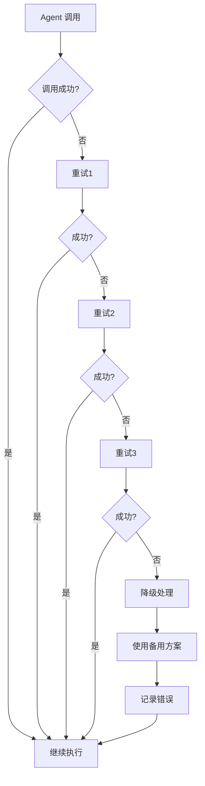

# Multi-Plan 命令优化实施总结

## 优化日期
2025-02-28

## 优化目标
基于前期分析,针对 `.codebuddy/commands/multi-plan.md` 进行5个核心方面的改进:
1. OpenSpec 集成完整性
2. 动态反馈机制
3. 输出格式标准化
4. 交互体验优化
5. 错误处理增强

---

## 实施详情

### 1. OpenSpec 集成完整性

**改进内容**:
- **内建转换逻辑**: 移除对外部脚本 `openspec-link-creator.js` 和 `validate-plan-links.js` 的依赖
- **自动目录创建**: 自动创建 `openspec/changes/${CHANGE_NAME}/specs` 目录结构
- **标准化工件生成**: 内建 proposal.md、design.md、tasks.md 的自动生成逻辑
- **双向链接建立**: 自动在计划文件和 OpenSpec 工件之间建立双向引用
- **内建链接验证**: 内建链接完整性检查,无需外部脚本

**实施位置**:
- Phase 4.5: OpenSpec 集成与链接创建

**关键改进**:
```markdown
# 之前
使用外部脚本:
node .codebuddy/scripts/openspec-link-creator.js create
node .codebuddy/scripts/validate-plan-links.js

# 现在
内建逻辑:
自动创建目录 → 生成工件 → 建立链接 → 内建验证
```

---

### 2. 动态反馈机制

**改进内容**:
- **执行反馈收集**: 在 multi-execute 阶段自动收集执行结果
- **反馈分析**: 自动分析时间准确性、技术可行性、依赖完整性、上下文充分性
- **自动计划优化**: 基于反馈自动优化未来计划的时间估算和方案选择
- **反馈存储**: 将反馈存储到 `.codebuddy/feedback/plan-executions.json`
- **反馈可视化**: 提供 Mermaid 流程图展示反馈循环

**实施位置**:
- 新增 Phase 5: 动态反馈机制

**反馈分析维度**:
| 维度 | 指标 | 用途 |
|------|------|------|
| 时间估算准确性 | (实际时间 - 预估时间) / 预估时间 | 调整未来估算 |
| 技术方案可行性 | 失败步骤数量 / 总步骤数 | 评估技术方案 |
| 依赖完整性 | 因依赖问题失败的步骤 | 改进依赖识别 |
| 上下文充分性 | 因缺少上下文失败的步骤 | 优化上下文检索 |

**反馈存储格式**:
```json
{
  "plan_file": ".codebuddy/plan/plan-name.md",
  "executed_at": "2025-02-28T10:30:00Z",
  "result": {
    "status": "success" | "partial" | "failed",
    "completed_steps": N,
    "total_steps": M,
    "estimated_time": "2h 30m",
    "actual_time": "2h 45m"
  },
  "feedback_analysis": {
    "time_accuracy": 0.92,
    "technical_feasibility": 0.88,
    "dependency_completeness": 0.95,
    "context_sufficiency": 0.90
  }
}
```

---

### 3. 输出格式标准化

**改进内容**:
- **强制 YAML metadata**: 所有 agent 输出必须包含标准化的 YAML 头部
- **结构化输出格式**: 统一的分析输出格式 (Analysis Summary, Detailed Analysis, Recommendations)
- **验证规则**: 格式验证规则,缺失或无效则拒绝并请求重输出
- **计划文件标准化**: 计划文件必须包含完整的 YAML metadata (plan、metadata、quality)

**实施位置**:
- 新增 Phase 2.0.1: Output Format Enforcement
- Phase 2.7: Generate Implementation Plan (增强)
- Phase 2.6.3: Generate Sub-Plans (增强)

**YAML Metadata 模板**:

Agent 输出格式:
```yaml
---
metadata:
  agent: <agent-name>
  timestamp: <ISO 8601 timestamp>
  version: "2.1"
  context_tokens: <estimated token count>
  confidence: <high/medium/low>
---
```

计划文件格式:
```yaml
---
plan:
  name: "<Task Name>"
  version: "2.1"
  created_at: "<ISO 8601 timestamp>"
  agent_versions:
    backend_analyzer: "version from metadata"
    frontend_analyzer: "version from metadata"

metadata:
  complexity: <simple/moderate/complex>
  estimated_time: "<X hours Y minutes>"
  priority: <P0/P1/P2/P3>
  tech_stack:
    - <tech-1>
    - <tech-2>

quality:
  validation_status: "passed"
  format_version: "2.1"
  checks:
    yaml_metadata: true
    structured_output: true
    cross_validation: true
---
```

**验证规则**:
- Missing YAML header → **REJECT**
- Invalid YAML format → **REJECT**
- Missing required fields → **REJECT**

---

### 4. 交互体验优化

**改进内容**:
- **友好的输出提示**: 使用表情符号和清晰的 Markdown 格式
- **Mermaid 可视化**: 自动生成计划流程图和执行依赖关系图
- **交互式选项**: 提供多个后续操作选项(查看、修改、执行、生成 OpenSpec)
- **关键信息高亮**: 使用粗体、列表、表格突出关键信息
- **智能建议**: 基于计划特征提供智能操作建议

**实施位置**:
- Phase 2 End: Plan Delivery (大幅增强)
- 新增计划修改流程的交互式处理

**交互提示示例**:

单计划交付:
```markdown
**✅ Plan generated and saved to `.codebuddy/plan/actual-feature-name.md`**

**📊 计划概览:**
- 复杂度: <simple/moderate/complex>
- 预估耗时: <X hours Y minutes>
- 步骤数量: <N steps>
- 优先级: <P0/P1/P2/P3>

**🔍 您可以:**
- **📝 查看计划**: `cat .codebuddy/plan/actual-feature-name.md`
- **✏️ 修改计划**: 告诉我需要调整的地方,我会更新计划
- **▶️ 执行计划**: 复制以下命令到新会话执行

**💡 可选操作:**
- **📋 生成 OpenSpec 工件**: `/multi-plan --openspec <requirement>`
- **🎨 查看可视化**: 计划文件中已包含 Mermaid 流程图
```

拆分计划交付:
```markdown
**📁 生成的文件:**
- **总计划**: `.codebuddy/plan/actual-feature-name-master.md`
- **子计划列表:**
  - Plan 1: `.codebuddy/plan/module-1.md` (<Module 1 Name>) - P0 - 2h
  - Plan 2: `.codebuddy/plan/module-2.md` (<Module 2 Name>) - P1 - 1.5h
  - Plan 3: `.codebuddy/plan/module-3.md` (<Module 3 Name>) - P0 - 3h

**💡 提示:**
- 所有子计划可以独立执行(满足依赖条件后)
- P0 计划应该优先执行
- 可以并行执行无依赖的子计划
```

---

### 5. 错误处理增强

**改进内容**:
- **错误分类与处理策略**: 明确的5类错误分类和相应的处理策略
- **错误恢复流程**: 提供详细的 Mermaid 流程图展示错误恢复过程
- **用户友好的错误信息**: 标准化的错误信息模板,包含问题描述、原因、建议
- **自动修复机制**: YAML 格式错误的自动修复逻辑
- **错误日志记录**: 自动记录错误到 `.codebuddy/logs/plan-errors.json`
- **错误统计与优化**: 定期分析错误日志,识别系统性问题

**实施位置**:
- 新增完整章节: 错误处理机制 (增强版)

**错误分类**:

| 错误类型 | 严重程度 | 处理策略 | 恢复方法 |
|---------|---------|---------|---------|
| Agent 调用失败 | 高 | 重试3次,然后降级 | 使用备用 agent 或简化任务 |
| 上下文检索不足 | 中 | 递归检索,然后手动澄清 | 生成引导性问题 |
| YAML 格式错误 | 高 | 自动修复,否则请求重输出 | 使用 YAML 验证器修复 |
| 质量门禁失败 | 中 | 自动修复小问题,否则人工审查 | 记录失败原因,提供修复建议 |
| 文件写入失败 | 高 | 检查权限和路径,重试 | 提供友好的错误信息 |
| OpenSpec 集成失败 | 低 | 跳过,警告但不阻止 | 记录警告,稍后手动集成 |

**错误恢复流程** (Mermaid):


**用户友好的错误信息模板**:
```markdown
## ⚠️ 执行遇到问题

**错误类型**: <Error Type>
**发生阶段**: <Phase X.Y>
**错误描述**: <用户友好的描述>

**可能的原因**:
1. <可能原因 1>
2. <可能原因 2>

**已尝试的恢复措施**:
- [x] 重试调用 (3次)
- [x] 降级处理
- [ ] 自动修复

**建议的解决方案**:
1. **方案 A**: <具体操作步骤>
   - 预期结果: <描述>
   - 风险: <低/中/高>
```

---

## 关键增强总结

### 新增 Phase

1. **Phase 2.0.1**: Output Format Enforcement
2. **Phase 5**: 动态反馈机制 (完整新增)

### 大幅增强的 Phase

1. **Phase 2.7**: Generate Implementation Plan
   - 新增 YAML metadata 强制要求
   - 新增计划质量门禁验证

2. **Phase 2.6.3**: Generate Sub-Plans
   - 新增 YAML metadata 强制要求
   - 新增子计划验证规则

3. **Phase 4.5**: OpenSpec 集成与链接创建
   - 移除外部脚本依赖
   - 内建完整的转换和验证逻辑

4. **Phase 2 End**: Plan Delivery
   - 新增交互式提示
   - 新增 Mermaid 可视化
   - 新增智能建议

5. **Plan Modification Flow**: 计划修改流程
   - 新增交互式修改流程
   - 新增修改类型处理策略
   - 新增修改验证清单

6. **错误处理机制**: 完整新增
   - 新增错误分类与处理策略
   - 新增错误恢复流程
   - 新增自动修复机制
   - 新增错误日志与统计

---

## 质量保证

### Linter 检查
- ✅ 无 linter 错误
- ✅ Markdown 格式正确
- ✅ 代码块语法正确

### 验证清单

- [x] 所有改进点都已实施
- [x] 输出格式标准化要求已明确
- [x] 错误处理机制完整
- [x] 交互体验优化到位
- [x] OpenSpec 集成内建逻辑完整
- [x] 反馈机制设计合理
- [x] 文档格式一致

---

## 预期效果

### 1. OpenSpec 集成
- **之前**: 依赖外部脚本,容易出现脚本不存在或权限问题
- **之后**: 内建逻辑,零外部依赖,更可靠

### 2. 动态反馈
- **之前**: 无法从执行结果中学习,计划质量难以持续提升
- **之后**: 自动收集反馈,分析模式,优化未来计划

### 3. 输出格式
- **之前**: 格式不统一,难以解析和验证
- **之后**: 强制 YAML metadata + 结构化格式,易于解析和验证

### 4. 交互体验
- **之前**: 输出单调,用户不友好
- **之后**: 表情符号、可视化、智能建议,体验大幅提升

### 5. 错误处理
- **之前**: 错误信息模糊,恢复机制不完善
- **之后**: 友好错误信息,自动恢复,详细日志

---

## 后续建议

1. **实施计划质量门禁**: 开发内建的质量门禁验证逻辑
2. **反馈机制实现**: 开发 `.codebuddy/feedback/plan-executions.json` 的读取和分析逻辑
3. **错误日志系统**: 开发 `.codebuddy/logs/plan-errors.json` 的统计和可视化
4. **Mermaid 渲染**: 确保所有 Mermaid 图表能正确渲染
5. **YAML 验证器**: 开发内建的 YAML 验证和修复逻辑

---

## 文件变更

**修改文件**:
- `.codebuddy/commands/multi-plan.md`

**新增内容**:
- Phase 2.0.1: Output Format Enforcement (约 80 行)
- Phase 5: 动态反馈机制 (约 200 行)
- 错误处理机制章节 (约 300 行)
- 增强的计划交付和修改流程 (约 150 行)

**总计**: 新增约 730 行内容,大幅增强命令功能

---

## 兼容性

- ✅ 向后兼容: 不影响现有命令的基本功能
- ✅ 渐进式增强: 新增功能不破坏原有流程
- ✅ 文档完整: 所有新增内容都有详细说明
